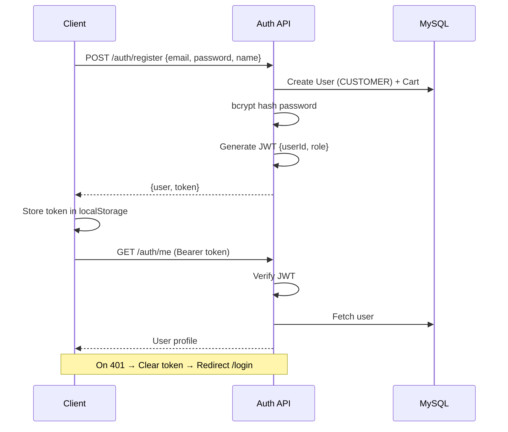
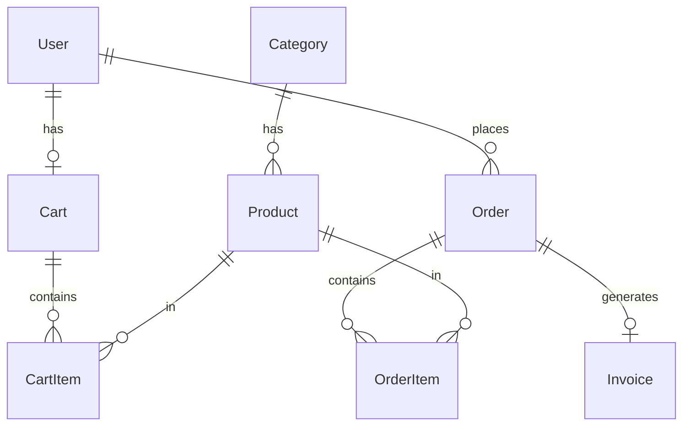

# FreshBasket — Architecture Document

Premium departmental store & fresh vegetable delivery platform (MVP).

---

## 1. Folder Structure

```
departmental-store/
├── prisma/
│   └── schema.prisma              # Single source of truth for DB models
│
├── backend/
│   ├── uploads/                   # Local file storage (MVP)
│   ├── .env.example
│   ├── package.json
│   └── src/
│       ├── server.js              # Express entry point
│       ├── config/
│       │   ├── env.js             # Environment variables
│       │   └── prisma.js          # Prisma client singleton
│       ├── middleware/
│       │   ├── auth.middleware.js # JWT + RBAC
│       │   ├── error.middleware.js
│       │   ├── upload.middleware.js
│       │   └── validate.middleware.js
│       ├── utils/
│       │   ├── apiResponse.js
│       │   └── asyncHandler.js
│       ├── routes/
│       │   └── index.js           # Route aggregator
│       ├── prisma/
│       │   └── seed.js
│       └── modules/               # Feature-based modules (LMS pattern)
│           ├── auth/
│           │   ├── auth.routes.js
│           │   ├── auth.controller.js
│           │   ├── auth.service.js
│           │   └── auth.validation.js
│           ├── product/
│           ├── category/
│           ├── cart/
│           ├── order/
│           ├── invoice/
│           ├── enquiry/
│           ├── admin/
│           └── customer/
│
└── frontend/
    ├── index.html
    ├── vite.config.js
    ├── package.json
    └── src/
        ├── main.jsx
        ├── App.jsx                # Route definitions
        ├── index.css              # Tailwind + design tokens
        ├── context/
        │   └── AuthContext.jsx
        ├── hooks/
        │   └── useProtectedRoute.js
        ├── layouts/
        │   ├── LandingLayout.jsx
        │   └── DashboardLayout.jsx
        ├── services/              # API layer (Axios)
        │   ├── api.js
        │   ├── authService.js
        │   ├── productService.js
        │   └── ...
        ├── utils/
        │   └── formatters.js
        ├── components/
        │   ├── ui/                # Reusable primitives
        │   ├── landing/
        │   ├── customer/
        │   └── admin/
        └── pages/
            ├── landing/           # Public marketing pages
            ├── auth/              # Login / Register
            ├── customer/          # Customer panel
            └── admin/             # Admin panel
```

---

## 2. Prisma Schema

Located at `prisma/schema.prisma`. Key design decisions:

| Model     | Purpose                          |
|-----------|----------------------------------|
| User      | ADMIN + CUSTOMER roles           |
| Category  | Product grouping                 |
| Product   | Store inventory                  |
| Cart      | One cart per customer            |
| CartItem  | Line items in cart               |
| Order     | Placed orders with status flow   |
| OrderItem | Snapshot of price at order time  |
| Invoice   | PDF invoice linked to order      |
| Enquiry   | Landing/contact form submissions |

Enums: `Role`, `ProductStatus`, `CategoryStatus`, `OrderStatus`, `PaymentMethod`, `EnquirySource`.

---

## 3. Express Backend Architecture

```
Request → CORS → JSON Parser → /api Routes → Middleware Chain → Controller → Service → Prisma → MySQL
                                                                                    ↓
                                                                              apiResponse
```

### Module Pattern (per feature)

```
routes.js    → HTTP endpoints + middleware stack
controller.js → Request/response handling
service.js   → Business logic + DB operations
validation.js → Zod schemas
```

### Middleware Stack

| Middleware    | Used On                    |
|---------------|----------------------------|
| authenticate  | Protected routes           |
| authorize     | Role-specific routes       |
| validate      | Body/query/params (Zod)    |
| upload        | Product/category images    |

### API Base: `/api`

| Module    | Prefix           |
|-----------|------------------|
| Auth      | `/auth`          |
| Products  | `/products`      |
| Categories| `/categories`    |
| Cart      | `/cart`          |
| Orders    | `/orders`        |
| Invoices  | `/invoices`      |
| Enquiries | `/enquiries`     |
| Admin     | `/admin`         |
| Customer  | `/customer`      |

---

## 4. React Component Architecture

```
App.jsx
├── LandingLayout (public)
│   └── pages/landing/*
├── Auth Pages (standalone)
│   └── Login / Register
├── Customer Panel
│   └── DashboardLayout + ProtectedRoute(CUSTOMER)
│       └── pages/customer/*
└── Admin Panel
    └── DashboardLayout + ProtectedRoute(ADMIN)
        └── pages/admin/*
```

### Layer Responsibilities

| Layer      | Responsibility                          |
|------------|-----------------------------------------|
| Pages      | Route-level views, data fetching        |
| Layouts    | Shell, navigation, auth-aware header    |
| Components | Reusable UI (Card, Button, Input)       |
| Services   | Axios API calls                         |
| Context    | Global auth state                       |
| Hooks      | Route guards, custom logic              |
| Utils      | Formatters, constants                   |

### Data Fetching

TanStack Query for server state. Mutations invalidate related query keys.

---

## 5. API Flow

### Product Browse (Public → Customer)

```
GET /api/categories          → Filter sidebar
GET /api/products?categoryId → Product grid
POST /api/cart               → Add item (auth required)
GET /api/cart                → Cart page
POST /api/orders             → Checkout → Order created, cart cleared, stock decremented
GET /api/orders              → Order history
```

### Admin Operations

```
GET  /api/admin/dashboard    → Stats cards
CRUD /api/products         → Product management
CRUD /api/categories       → Category management
GET  /api/orders             → All orders
PUT  /api/orders/:id/status  → Status updates
POST /api/invoices/generate/:orderId → PDF generation
GET  /api/enquiries          → Landing enquiries
```

### Enquiry (Public)

```
POST /api/enquiries  → No auth required
```

---

## 6. Authentication Flow



### RBAC Matrix

| Endpoint Pattern        | ADMIN | CUSTOMER | Public |
|-------------------------|-------|----------|--------|
| POST /auth/register     | —     | ✓        | ✓      |
| POST /auth/login        | —     | ✓        | ✓      |
| GET /products           | ✓     | ✓        | ✓      |
| POST /products          | ✓     | —        | —      |
| /cart/*                 | —     | ✓        | —      |
| POST /orders            | —     | ✓        | —      |
| PUT /orders/:id/status  | ✓     | —        | —      |
| /admin/*                | ✓     | —        | —      |
| POST /enquiries         | —     | —        | ✓      |
| GET /enquiries          | ✓     | —        | —      |

---

## 7. Database Relationships



### Relationship Rules

- **User → Cart**: 1:1 (created on registration)
- **Cart → CartItem**: 1:N (unique per product)
- **Category → Product**: 1:N (restrict delete if products exist)
- **Order → OrderItem**: 1:N (price snapshot at order time)
- **Order → Invoice**: 1:1 (generated on demand)
- **User → Order**: 1:N

---

## 8. Admin Workflow

```
Login (admin@freshbasket.com)
    ↓
Dashboard → View today's orders, revenue, pending count
    ↓
Categories → Create Vegetables, Fruits, Groceries, Daily Essentials
    ↓
Products → CRUD with image, price, stock, category, today's special flag
    ↓
Orders → View all orders → Update status:
         PENDING → PACKING → OUT_FOR_DELIVERY → DELIVERED
    ↓
Invoices → Generate PDF for delivered orders
    ↓
Customers → View customer list + order history
    ↓
Enquiries → Review landing page submissions
```

---

## 9. Customer Workflow

```
Landing Page → Browse marketing content
    ↓
Register / Login
    ↓
Dashboard → Welcome, recent orders, today's specials, delivery status
    ↓
Products → Filter by category → Add to cart
    ↓
Cart → Update quantity / remove items
    ↓
Checkout → Name, phone, address, notes, payment type
    ↓
Place Order → Stock decremented, cart cleared
    ↓
My Orders → Track status (Pending → Delivered)
    ↓
Profile → Update contact info & address
```

---

## 10. Step-by-Step Implementation Plan

### Phase 1 — Foundation (✅ Scaffolded)

- [x] Project structure (frontend + backend)
- [x] Prisma schema + enums
- [x] Express server + module architecture
- [x] JWT auth + RBAC middleware
- [x] Zod validation layer
- [x] Seed script (admin + categories + sample products)

**Run:**
```bash
# Create MySQL database: freshbasket
cd backend && cp .env.example .env
npm install && npm run db:push && npm run db:seed
npm run dev
```

### Phase 2 — Landing Website (✅ Scaffolded)

- [x] Home, About, Fresh Collection, Delivery, Testimonials, FAQ, Contact
- [x] Enquiry form with API integration
- [x] Premium dark UI (green + gold, glassmorphism, Framer Motion)
- [ ] Add real product images and hero assets
- [ ] SEO meta tags per page

### Phase 3 — Customer Panel (✅ Scaffolded)

- [x] Dashboard with stats + today's products
- [x] Product listing with category filter
- [x] Cart CRUD
- [x] Checkout flow
- [x] Order history
- [x] Profile management
- [ ] Quick reorder action on dashboard
- [ ] Product image upload display

### Phase 4 — Admin Panel (✅ Scaffolded)

- [x] Dashboard stats
- [x] Product CRUD
- [x] Category CRUD
- [x] Order status management
- [x] Customer list
- [x] Enquiry management
- [ ] Invoice UI (generate + download from orders page)
- [ ] Image upload in product/category forms (FormData)

### Phase 5 — Testing & Deployment

- [ ] End-to-end order flow test
- [ ] RBAC boundary tests
- [ ] Stock validation edge cases
- [ ] Production env setup
- [ ] Deploy backend (PM2 / Railway)
- [ ] Deploy frontend (Vercel / Netlify)
- [ ] MySQL production database
- [ ] Future: S3 for uploads

---

## Design System

| Token        | Value                    |
|--------------|--------------------------|
| Primary      | Green (#22c55e family)   |
| Accent       | Gold (#f59e0b family)    |
| Background   | Slate 950 (dark mode)    |
| Cards        | Glassmorphism (white/5)  |
| Radius       | rounded-2xl              |
| Animation    | Framer Motion fade/slide |

---

## Default Credentials (Seed)

| Role     | Email                  | Password  |
|----------|------------------------|-----------|
| Admin    | admin@freshbasket.com   | admin123  |

Customers register via `/register`.
